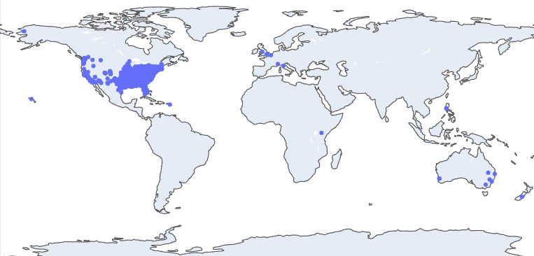

# Data scraping graves of a specific name from the database findagrave.com
Initially written as a project to explore historical trends from graves with the name George Washington, this python code can be used to scape Find a Grave for any first and last name. The graphs in the jupyter notebook are also flexible for reuse. 

## Libraries Used

The requirements.txt file lists all Python libraries that this repository depends on. They can all be installed using:

```bash
pip install -r requirements.txt
```
For your convenience, a very short summary of each library is provided below:

* Requests: Makes HTTP requests.
 
* Beautiful Soup: Converts data from HTML into a python-friendly format.
 
* Pandas: Enables the use of dataframes.
 
* Numpy: Provides additional organizational tools for dataframes.
 
* Matplotlib: A standard graphing library.
 
* Plotly: A more complicated graphing library that produces more elegant resents.
 
* Geopy: Locates the coordinates of addresses.

## Usage
```python
import find_a_grave_scraper as scraper

# (optional) choose a first and last name other than George Washington
name_first = George
name_last = Washington

# store data in a python dataframe.
dataframe = scraper.collect_and_sort_data(name_first, name_last)

# (optional) save to csv for future use. 
dataframe.to_csv('GraveData.csv', index = False) 
```
## Reproduce the Jupyter Notebook Graphs
The graphs are reproducible with the code in the notebook George_Washington_analysis.ipynb. If you use a custom name, make sure the dataframe is loaded into the graphs. Examples of the graphs are provided below.





## License
### GNU GPL v3
[](https://www.gnu.org/licenses/gpl-3.0)    
`[](https://www.gnu.org/licenses/gpl-3.0)`
